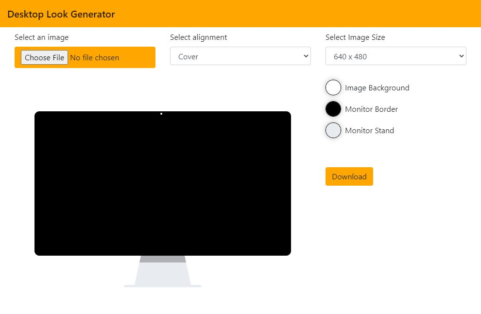

# Desktop Look Generator
Create a desktop preview of your project



## Getting Started

These instructions will get you a copy of the project up and running on your local machine for development and testing purposes. See deployment for notes on how to deploy the project on a live system.

### Prerequisites

* Node.js - Download on the [website](https://nodejs.org/en/download/)

### Installing

Clone the repository and execute the command in the root directory of the cloned project.

```
npm install
```

To watch for changes in the scss file run the following command.

```
npm run css-watch
```

## Built With

* [Bootstrap](https://getbootstrap.com/) - The CSS library used
* [html2canvas](https://html2canvas.hertzen.com/) - Convert Html to Canvas

## Authors

* **hdptrck** - *Initial work* - [hdptrck](https://github.com/hdptrck)

## License

This project is licensed under the MIT License - see the [LICENSE](LICENSE) file for details

## Acknowledgments

* Inspired by [this Pen](https://codepen.io/willpaige/pen/rFElD) from [Will Paige](https://github.com/willpaige) 
